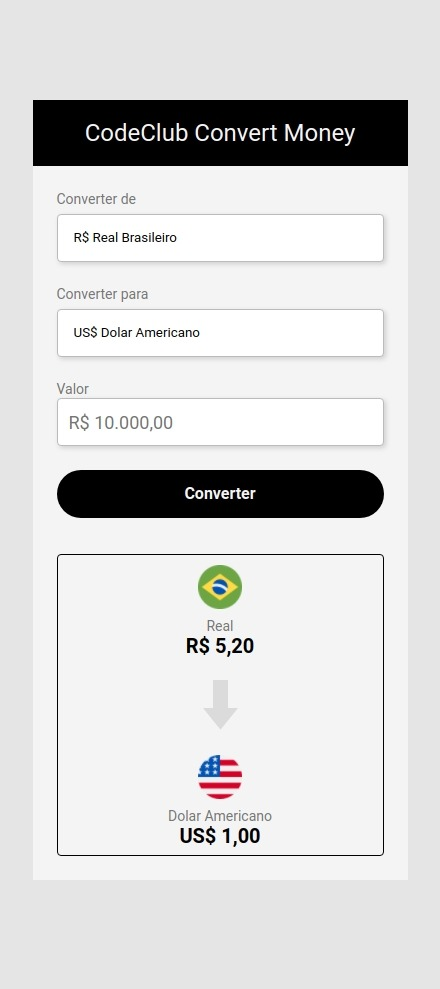
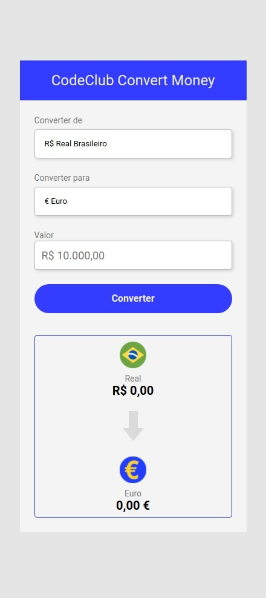
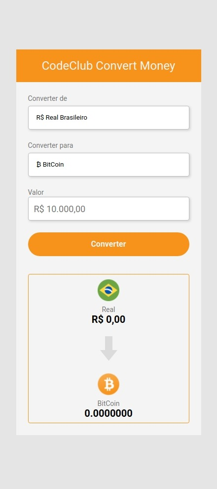
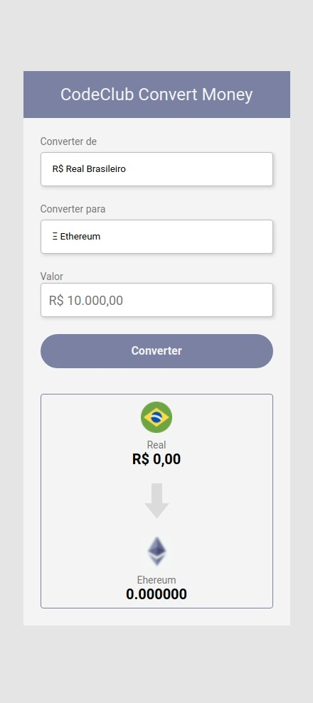

# ConvertMoney

<a href="https://yolmat.github.io/ConvertMoney/">  :smiley: Teste voce mesmo || Test it yourself</a>

   

> Nesse projeto fiz um conversor de moedas utilizando o HTML, CSS e JS || In this project I made a currency converter using HTML, CSS and JS

        

### Ajustes e melhorias

O projeto ainda está em desenvolvimento e as próximas atualizações serão voltadas nas seguintes tarefas:

- [x] html construction
- [x] css construction
- [x] js construction
- [x] construction cryptocurrencies
- [x] NodeJs construction

## 🤝 Colaboradores

Agradecemos às seguintes pessoas que contribuíram para este projeto:

<table>
  <tr>
    <td align="center">
      <a href="www.github.com/yolmat">
         
        
          <b>Yolmat</b>
        
      </a>
    </td>
  </tr>
</table>

[⬆ Voltar ao topo](#nome-do-projeto) 
